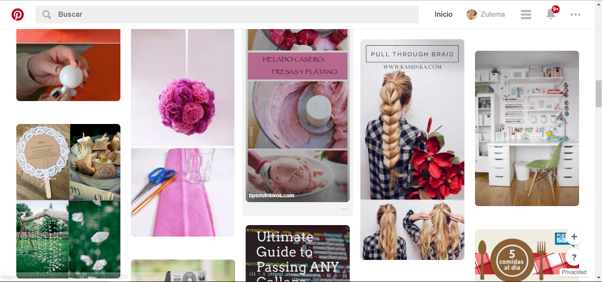

## Reconociendo UX-UI

En la imagen  de la web de pinterest podemos notar los componentes  :

**UI:**

-El diseño de los botones

-La barra de categorias que aparece cuando le das click en el buscador te muestra porejemplo zapatos: casuales , elegantes ,para niñas ,jovenes ,etc.

-Los iconos de user ,menu .

-Los colores del logo de pinterst.

-La barra que aparece al hace click en menu.

-La forma como se presenta la imagen una vez selceccionada y al transportarse a otra pagina.

**UX:**

-Poder tener un fichero de los pines que te gustaron.

-Que puedas buscar una cosa en la barra de busqueda y te sugieraqn mas alternativas.

-Que puedas seleccionar cuales son los temas que mas prefieres y te notifiquen respecto a ello.

-Que cambien constantemente los pines que se muestran en la pantalla.
